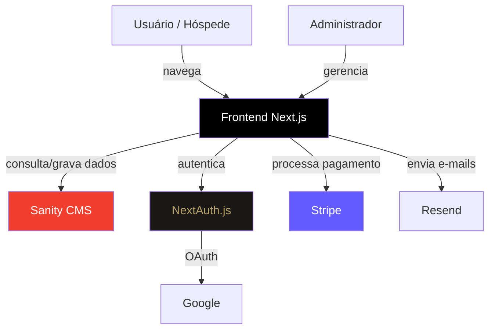

<div align="center">

# 🏖️ Villa Daniella Beach Homes

### Sistema de Gestão Hoteleira para Casas de Praia

*Plataforma web completa para reserva e gerenciamento de acomodações à beira-mar*

<br>

[](https://nextjs.org/)
[](https://www.typescriptlang.org/)
[](https://www.sanity.io/)
[](https://stripe.com/)
[](https://tailwindcss.com/)

[]()
[]()

[🔗 Ver Demo](http://villa-daniella.vercel.app/) · [✨ Funcionalidades](#-funcionalidades) · [🚀 Como Rodar](#-como-rodar-localmente) · [👥 Equipe](#-equipe)

</div>

---

## 📖 Sobre o Projeto

O **Villa Daniella Beach Homes** é uma plataforma web de gestão hoteleira desenvolvida para administrar e comercializar acomodações de praia. O sistema oferece uma experiência completa, desde a navegação e busca de acomodações pelo hóspede até o processamento de pagamentos e a administração do negócio por um painel exclusivo.

O projeto foi construído com foco em **boas práticas de engenharia de software**: arquitetura organizada, código tipado, fonte única de verdade para dados compartilhados, autenticação segura e separação clara de responsabilidades entre as camadas pública, administrativa e de conteúdo.

---

## 🔗 Demo ao Vivo

> 🌐 **Acesse:** [villa-daniella.vercel.app](http://villa-daniella.vercel.app/)

---

## ✨ Funcionalidades

### 🏠 Área Pública (Hóspede)
- **Catálogo de acomodações** com cartões visuais (foto, preço, capacidade)
- **Busca dinâmica** por tipo de acomodação, número de camas e hóspedes
- **Página de detalhes** com galeria de fotos, descrição e comodidades
- **Sistema de reservas** com seleção de datas
- **Pagamento online** integrado via Stripe
- **Avaliações** das acomodações

### 🔐 Autenticação
- Login com **Google** (OAuth)
- Login com **e-mail e senha** (criptografados com bcrypt)
- **Recuperação de senha** por e-mail (fluxo completo de reset)
- **E-mail de boas-vindas** automático no cadastro

### 🛠️ Painel Administrativo
- **Controle de acesso por papéis (RBAC):** Super Admin, Admin e Visualizador
- **Gerenciamento de acomodações:** criar, editar, excluir, upload de imagens
- **Gerenciamento de reservas** e ocupação
- **Gerenciamento de usuários** (ativação/desativação)
- **Dashboard** com gráficos e taxa de ocupação

---

## 🛠️ Tecnologias

| Camada | Tecnologias |
|--------|-------------|
| **Frontend** | Next.js 13 (App Router), React, TypeScript, Tailwind CSS |
| **CMS / Banco** | Sanity CMS (headless) |
| **Autenticação** | NextAuth.js (Google OAuth + Credentials), bcrypt |
| **Pagamentos** | Stripe |
| **E-mails** | Resend |
| **Hospedagem** | Vercel |

---

## 🏗️ Arquitetura

### Visão Geral do Sistema



### Estrutura de Pastas

```
src/
├── app/
│   ├── (web)/          # Site público (acomodações, auth, reservas)
│   ├── (cms)/studio/   # Sanity Studio embutido
│   ├── admin/          # Painel administrativo (RBAC)
│   └── api/            # Rotas de backend (auth, stripe, rooms, admin)
├── components/         # Componentes de UI reutilizáveis
├── libs/               # Configurações e fonte única de verdade
│   ├── sanity.ts       #   Cliente Sanity
│   ├── auth.ts         #   Configuração NextAuth
│   ├── roomTypes.ts    #   Tipos de acomodação + constantes (DRY)
│   ├── sanityQueries.ts#   Queries GROQ centralizadas
│   ├── stripe.ts       #   Configuração Stripe
│   └── email.ts        #   Templates e envio de e-mails
├── models/             # Tipos TypeScript do domínio
└── schemas/            # Schemas do Sanity (hotelRoom, booking, user...)
```

> **Destaque de arquitetura:** O arquivo `roomTypes.ts` funciona como **fonte única de verdade** para os tipos de acomodação e constantes padrão. O schema do Sanity, a API e o painel admin importam dele, eliminando divergências e duplicação (princípio DRY).

---

## 📸 Screenshots

<div align="center">

### 🏠 Página Inicial
<!-- Adicione o print da home aqui -->
`[ Adicione aqui: screenshot da home ]`

### 🔍 Catálogo de Acomodações
<!-- Adicione o print do catálogo aqui -->
`[ Adicione aqui: screenshot do catálogo com busca ]`

### 🛏️ Detalhes da Acomodação
<!-- Adicione o print da página de detalhes aqui -->
`[ Adicione aqui: screenshot da página de detalhes ]`

### 🛠️ Painel Administrativo
<!-- Adicione o print do admin aqui -->
`[ Adicione aqui: screenshot do painel admin ]`

</div>

> **Como adicionar screenshots:** Crie uma pasta `docs/screenshots/` no repositório, coloque as imagens lá e referencie com ``.

---

## 🚀 Como Rodar Localmente

### Pré-requisitos
- [Node.js](https://nodejs.org/) (versão 18 ou superior)
- npm ou yarn
- Conta no [Sanity](https://www.sanity.io/), [Stripe](https://stripe.com/) e [Resend](https://resend.com/)

### Passo a passo

```bash
# 1. Clone o repositório
git clone https://github.com/kcolive/meu-hotel-ypua.git

# 2. Entre na pasta do projeto
cd meu-hotel-ypua

# 3. Instale as dependências
npm install --legacy-peer-deps

# 4. Configure as variáveis de ambiente
#    (crie um arquivo .env.local — veja a seção abaixo)

# 5. Rode o servidor de desenvolvimento
npm run dev
```

O projeto estará disponível em **http://localhost:3000**
O Sanity Studio estará em **http://localhost:3000/studio**

> ⚠️ **Nota:** Usamos `--legacy-peer-deps` devido a conflitos de dependência entre versões do `@sanity/client`. É esperado e não afeta o funcionamento.

---

## 🔐 Variáveis de Ambiente

Crie um arquivo `.env.local` na raiz do projeto com as seguintes variáveis:

```env
# Sanity
NEXT_PUBLIC_SANITY_PROJECT_ID=seu_project_id
NEXT_PUBLIC_SANITY_DATASET=production
SANITY_API_TOKEN=seu_token

# NextAuth
NEXTAUTH_SECRET=sua_chave_secreta
NEXTAUTH_URL=http://localhost:3000

# Google OAuth
GOOGLE_CLIENT_ID=seu_client_id
GOOGLE_CLIENT_SECRET=seu_client_secret

# Stripe
STRIPE_SECRET_KEY=sua_chave_stripe
STRIPE_WEBHOOK_SECRET=seu_webhook_secret

# Resend (e-mails)
RESEND_API_KEY=sua_chave_resend
```

> 🔒 **Segurança:** O arquivo `.env.local` está no `.gitignore` e **nunca** deve ser commitado. Chaves de API são sensíveis e não podem ir para o repositório.

---

## 👥 Equipe

Projeto desenvolvido de forma colaborativa por:

| Integrante | Função |
|------------|--------|
| **Karen Cruz de Oliveira** | Desenvolvedora Fullstack |
| **Michel Davi Busquet de Sousa** | Desenvolvedor Fullstack |
| **Guilherme Nardi Matos** | Desenvolvedor Fullstack |
| **Gustavo Santana Jacinto** | Desenvolvedor Fullstack |

---

## 🎓 Contexto Acadêmico

Este projeto foi desenvolvido como **Projeto Aplicado** do curso de **Análise e Desenvolvimento de Sistemas (ADS)** do **UniSENAI Florianópolis**.

O objetivo foi aplicar, em um cenário realista de negócio, os conhecimentos de:
- Desenvolvimento web fullstack moderno
- Arquitetura de aplicações
- Integração com serviços externos (pagamentos, autenticação, e-mail)
- Trabalho colaborativo com Git/GitHub (branches, Pull Requests, code review)
- Boas práticas de código (tipagem, DRY, separação de responsabilidades)

---

## 📄 Licença

Este projeto foi desenvolvido para fins **acadêmicos e educacionais** no contexto do UniSENAI.

---

<div align="center">

**🏖️ Villa Daniella Beach Homes**

*Desenvolvido com dedicação por estudantes de ADS — UniSENAI Florianópolis*

</div>
